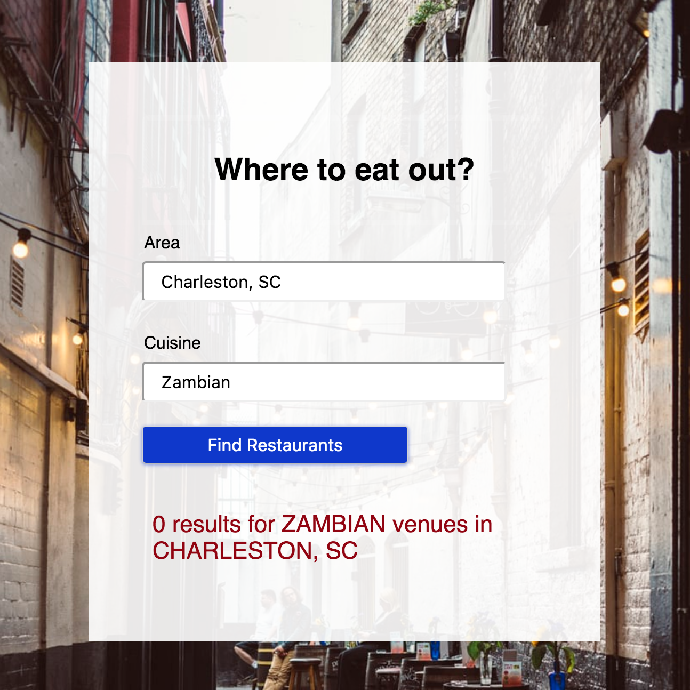

# Where to eat out?

## Summary
Helps users plan going out to eat. The app takes user input for location and desired cuisine. Results include venue name, address, photo, and a list of suggested next venues.

## Motivation
I love eating out and trying new restaurants :fork_and_knife:. I wanted to take some of the 'thinking' out of going out to eat.

## Tech
Built with HTML, CSS, Javascript, jQuery, & foursquare API

## Screenshots

Search:

<kbd>

</kbd>

Results:

<kbd>

</kbd>

Error Handling:

<kbd>

</kbd>

## Live Demo
https://lhendriks1.github.io/where-to-eat-out/
